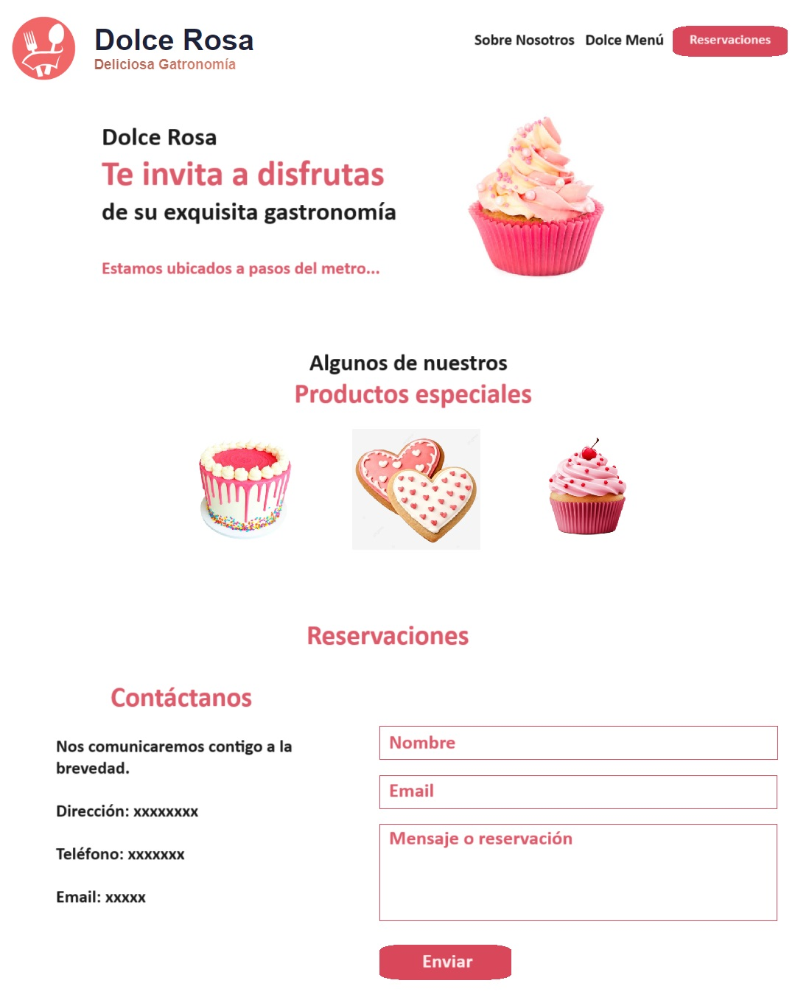

# PROYECTO 4: Restaurant APP

## **ÍNDICE**

[1. Intro](#1-intro)
[2. Prototipo](#2-prototipo)
[3. Requisitos](#3-requisitos-y-entregables)
[4. Criterios de evaluación](#4-criterios-de-evaluaci%C3%B3n)

## 1. Intro
Se desarrolla el cuarto proyecto del Bootcamp, llamado "Restaurant APP". 
El proyecto se enfocó en la creación de una página web para un restaurant, utilizando React. La página web incluye información principal del restaurante, formulario de contacto y una sección de datos de ubicación y correo electrónico.

## 2. Prototipo
* 

## 3. Requisitos y entregables

### UI
- [ ] Desarrollar prototipado simple.
- [ ] Aplicar en todo el sitio HTML semántico de estándar no.5 (HTML5).
- [ ] Aplicar tipos de selectores en CSS.
- [ ] Sección Información del restaurante.
- [ ] OPCIONAL. Vista en móviles.
- [ ] OPCIONAL. Sección de reserva.
- [ ] OPCIONAL. Blog con un artículo.

### REACT
- [ ] Uso de props
- [ ] Uso de hooks useState
- [ ] Sección Información del restaurante.
- [ ] OPCIONAL. Vista en móviles.
- [ ] OPCIONAL. Sección de reserva.
- [ ] OPCIONAL. Blog con un artículo.

### CONTROL DE VERSIONES
- [ ] Crear un repositorio en GitHub.
- [ ] Realizar "commits" en tu repositorio, mínimo 5.

### DESPLIEGUE
- [ ] Crear una URL para compartir (puedes utilizar Netlify o GitHub Pages).
- [ ] Colocar descripción dentro del repositorio.

### ENTREGA A TIEMPO
- [ ] Entregar tu proyecto en el tiempo estipulado.

****

## 4. Criterios de evaluación

| ÁREA       | % DEL TOTAL |
| ------------- |:-------------:|
| UI      | 30%     |
| REACT      | 50%     |
| DESPLIEGUE | 10%      |
| ENTREGA A TIEMPO | 10%      |

****

****
